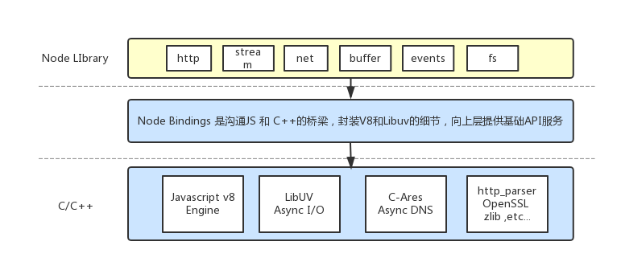

# NodeJS-Nucleus-Plus-Internals
NodeJS源码分析-由浅入深了解架构运行原理

Node版本基于v8.9.3 

从运行入口开始深入源码分析，由浅入深，共同学习。

 [1-0 NodeJS源码分析-1 Hello world](https://github.com/fzxa/NodeJS-Nucleus-Plus-Internals/blob/master/chapter1/chapter1-0-%E6%BA%90%E7%A0%81%E5%88%86%E6%9E%90-1%20Hello%20world.md)
 
 [1-1 NodeJS源码解析 - HTTP Server模块](https://github.com/fzxa/NodeJS-Nucleus-Plus-Internals/blob/master/chapter1/chapter1-1-HTTP%20Server%E6%A8%A1%E5%9D%97.md)
 
持续更新..
 
###NodeJS系统架构图：

 - Javascript V8 Engine: Nodejs javascript运行引擎
 - Libuv 是专门为Node.js开发的一个封装库，提供跨平台的异步I/O能力.
 - C-ares：提供了异步处理 DNS 相关的能力。
 - http_parser、OpenSSL、zlib 等：提供包括 http 解析、SSL、数据压缩等其他的能力。
 
###整体流程图
 
 
 

