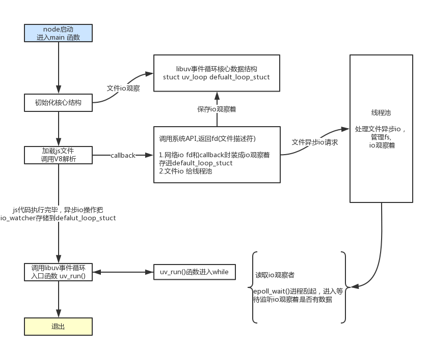

### NodeJS源码分析-1 Hello world

#### 简要
Node已经如今发展很快，已经相对稳定和成熟，在某些时候有必要知道其内部运行原理以及运行处理过程。
种一棵树最好的时间是十年前 其次是现在。希望能坚持下去。

### Nodejs当前最新版本 8.9.4
[NodeJS官方网站下载源码](https://nodejs.org/en/download/)


Node.js主要分为四大部分，Node Standard Library，Node Bindings，V8，Libuv

大体流程是这样的：

1. 初始化 V8 、LibUV , OpenSSL

2. 创建 Environment 环境

3. 设置 Process 进程对象

4. 执行 node.js 文件


解压包后代码结构如下：
```
├── AUTHORS
├── BSDmakefile   # bsd平台makefile文件
├── BUILDING.md
├── CHANGELOG.md
├── CODE_OF_CONDUCT.md
├── COLLABORATOR_GUIDE.md
├── CONTRIBUTING.md
├── CPP_STYLE_GUIDE.md
├── GOVERNANCE.md
├── LICENSE
├── Makefile     # Linux平台makefile文件
├── README.md
├── android-configure
├── benchmark
├── common.gypi
├── configure
├── deps          # Node底层核心依赖； 最核心的两块V8 Engine和libuv事件驱动的异步I/O模型库
├── doc           
├── lib           # Node后端核心库
├── node.gyp      # Node编译任务配置文件 
├── node.gypi
├── src           # C++内建模块
├── test          # 测试代码
├── tools         # 编译时用到的工具
└── vcbuild.bat   # Windows跨平台makefile文件
```

### Hello World 底层运行过程
[官方Hello world代码](https://nodejs.org/en/about/)
```
#app.js
const http = require('http');

const hostname = '127.0.0.1';
const port = 3000;

const server = http.createServer((req, res) => {
  res.statusCode = 200;
  res.setHeader('Content-Type', 'text/plain');
  res.end('Hello World\n');
});

server.listen(port, hostname, () => {
  console.log(`Server running at http://${hostname}:${port}/`);
});
```
整体运行流程图


一个简单的Helloworld涉及到多个模块：
- global 
- module
- http
- event
- net 

### 1.0 从main执行到js
入口 src/node_main.cc 106行 通过 src/node.cc 调用 node::Start(argc, argv);
node_main.cc
```
namespace node {
  extern bool linux_at_secure;
}  // namespace node

int main(int argc, char *argv[]) {
#if defined(__linux__)
  char** envp = environ;
  while (*envp++ != nullptr) {}
  Elf_auxv_t* auxv = reinterpret_cast<Elf_auxv_t*>(envp);
  for (; auxv->a_type != AT_NULL; auxv++) {
    if (auxv->a_type == AT_SECURE) {
      node::linux_at_secure = auxv->a_un.a_val;
      break;
    }   
  }
#endif
  // Disable stdio buffering, it interacts poorly with printf()
  // calls elsewhere in the program (e.g., any logging from V8.)
  setvbuf(stdout, nullptr, _IONBF, 0); 
  setvbuf(stderr, nullptr, _IONBF, 0); 
  // main作为入口调用node::Start
  return node::Start(argc, argv);
}
#endif
```

### 1.1 node::Start 加载js
调用顺序：

Start() -> LoadEnviroment() -> ExecuteString()

最终在LoadEnvrioment()里面加载node.js文件，调用ExecuteString() 解析执行node.js文件，返回值是一个f_value

并且在ExecuteString()调用V8的 Script::Compile() 和 Script::Run()两个接口去解析执行js代码。


node.cc
```
# Nodejs启动入口， 
inline int Start(Isolate* isolate, IsolateData* isolate_data,
                 int argc, const char* const* argv,
                 int exec_argc, const char* const* exec_argv) {
  HandleScope handle_scope(isolate);
  Local<Context> context = Context::New(isolate);
  Context::Scope context_scope(context);
  Environment env(isolate_data, context);
  CHECK_EQ(0, uv_key_create(&thread_local_env));
  uv_key_set(&thread_local_env, &env);
  env.Start(argc, argv, exec_argc, exec_argv, v8_is_profiling);

  const char* path = argc > 1 ? argv[1] : nullptr;
  StartInspector(&env, path, debug_options);

  if (debug_options.inspector_enabled() && !v8_platform.InspectorStarted(&env))
    return 12;  // Signal internal error.

  env.set_abort_on_uncaught_exception(abort_on_uncaught_exception);

  if (force_async_hooks_checks) {
    env.async_hooks()->force_checks();
  }

  {
    Environment::AsyncCallbackScope callback_scope(&env);
    env.async_hooks()->push_async_ids(1, 0);
    
    //加载nodejs文件后调用ExecuteString()
    LoadEnvironment(&env); 
    env.async_hooks()->pop_async_id(1);
  }

  env.set_trace_sync_io(trace_sync_io);
  //事件循环池
  {
    SealHandleScope seal(isolate);
    bool more;
    PERFORMANCE_MARK(&env, LOOP_START);
    do {
      uv_run(env.event_loop(), UV_RUN_DEFAULT);

      v8_platform.DrainVMTasks();

      more = uv_loop_alive(env.event_loop());
      if (more)
        continue;

      EmitBeforeExit(&env);

      // Emit `beforeExit` if the loop became alive either after emitting
      // event, or after running some callbacks.
      more = uv_loop_alive(env.event_loop());
    } while (more == true);
    PERFORMANCE_MARK(&env, LOOP_EXIT);
  }

  env.set_trace_sync_io(false);

  const int exit_code = EmitExit(&env);
  RunAtExit(&env);
  uv_key_delete(&thread_local_env);

  v8_platform.DrainVMTasks();
  WaitForInspectorDisconnect(&env);
#if defined(LEAK_SANITIZER)
  __lsan_do_leak_check();
#endif

  return exit_code;
}

```

### 核心运行流程
1. 核心数据结构 default_loop_struct 结构体为struct uv_loop_s
当加载js文件时，如果代码有io操作，调用lib模块->底层C++模块->LibUV(deps uv)->拿到系统返回的一个fd（文件描述符），和 js代码传进来的回调函数callback，封装成一个io观察者（一个uv__io_s类型的对象），保存到default_loop_struct.

2. 进入事件池， default_loop_struct保存对应io观察着，V8 Engine处理js代码, main函数调用libuv进入uv_run(), node进入事件循环 ,判断是否有存活的观察者
- 如果也没有io, Node进程退出
- 如果有io观察者， 执行uv_run()进入epoll_wait()线程挂起，io观察者检测是否有数据返回callback, 没有数据则会一直在epoll_wait()等待执行 （server.listen(3000)会挂起一直等待）

