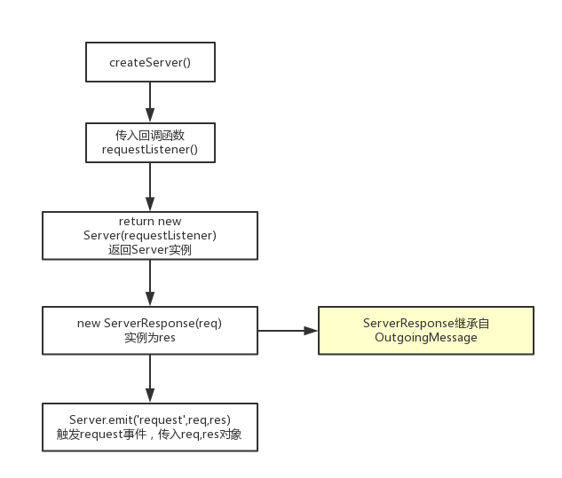

### NodeJS源码解析 - HTTP Server模块

上一篇文章提到了hello world中的http server 

http是nodejs中重要的模块之一，有必要了解它的运行原理

```
var http = require('http');
http.createServer((req, res) => {
  res.writeHead(200, { 'Content-Type': 'text/plain' });
  res.end('Hello World\n');
}).listen(port, hostname, () => {
  console.log(`Server running at http://${hostname}:${port}/`);
});
```

#### HTTP模块
1. 打开node-v8.9.3/lib/http.js 

首先引入的是http模块,模块抛出公共方法调用createServer实际上是返回Server实例，

createServer里面的回调函数（参数requestListener）

直接作为了Server的参数requestListener,而这个Server实际上是require('_http_server')
```
'use strict';

const agent = require('_http_agent');
const { ClientRequest } = require('_http_client');
const common = require('_http_common');
const incoming = require('_http_incoming');
const outgoing = require('_http_outgoing');
//引入私有_http_server模块
const server = require('_http_server');

const { Server } = server;
//创建server, 将回调函数作为参数
function createServer(requestListener) {
  return new Server(requestListener);
}

function request(options, cb) {
  return new ClientRequest(options, cb);
}

function get(options, cb) {
  var req = request(options, cb);
  req.end();
  return req;
}
//http模块暴露的所有公共方法
module.exports = { 
  _connectionListener: server._connectionListener,
  METHODS: common.methods.slice().sort(),
  STATUS_CODES: server.STATUS_CODES,
  Agent: agent.Agent,
  ClientRequest,
  globalAgent: agent.globalAgent,
  IncomingMessage: incoming.IncomingMessage,
  OutgoingMessage: outgoing.OutgoingMessage,
  Server,
  ServerResponse: server.ServerResponse,
  createServer, 
  get,
  request
};
```

打开文件node-v8.9.3/lib/_http_server.js 260行

实际上是为这个requestListener函数与'request'事件绑定到了一起，而'request '是方法parserOnIncoming里面抛出的一个事件
   
```
function Server(requestListener) {
  if (!(this instanceof Server)) return new Server(requestListener);
  net.Server.call(this, { allowHalfOpen: true }); 
 
  //如果有回调函数，对当前实例进行监听，若request有事件触发则调用回调
  if (requestListener) {
    this.on('request', requestListener);
  }

  // Similar option to this. Too lazy to write my own docs.
  // http://www.squid-cache.org/Doc/config/half_closed_clients/
  // http://wiki.squid-cache.org/SquidFaq/InnerWorkings#What_is_a_half-closed_filedescriptor.3F
  this.httpAllowHalfOpen = false;
  //当启动server实例时，观察者建立connect事件
  this.on('connection', connectionListener);

  this.timeout = 2 * 60 * 1000;
  this.keepAliveTimeout = 5000;
  this._pendingResponseData = 0;
  this.maxHeadersCount = null;
}

//net.Server继承Server
util.inherits(Server, net.Server);
```

#### 观察者request何时触发？
调用emit方法，将request事件发送给每一个监听的实例，并且传入req,res

server.emit('request', req, res); 这个事件也会同时抛出req和res两个对象

req变量与另一个叫做shouldKeepAlive的变量作参同时传入此函数parserOnIncoming

_http_server.js  592行 602行
```
//处理具体解析完毕的请求
function parserOnIncoming(server, socket, state, req, keepAlive) {
  resetSocketTimeout(server, socket, state);

  state.incoming.push(req);

  // If the writable end isn't consuming, then stop reading
  // so that we don't become overwhelmed by a flood of
  // pipelined requests that may never be resolved.
  if (!socket._paused) {
    var ws = socket._writableState;
    if (ws.needDrain || state.outgoingData >= ws.highWaterMark) {
      socket._paused = true;
      // We also need to pause the parser, but don't do that until after
      // the call to execute, because we may still be processing the last
      // chunk.
      socket.pause();
    }
  }
  //服务器通过ServerResponse实例，来个请求方发送数据。包括发送响应表头，发送响应主体
  var res = new ServerResponse(req);
  res._onPendingData = updateOutgoingData.bind(undefined, socket, state);

  res.shouldKeepAlive = keepAlive;
  DTRACE_HTTP_SERVER_REQUEST(req, socket);
  LTTNG_HTTP_SERVER_REQUEST(req, socket);
  COUNTER_HTTP_SERVER_REQUEST();

  if (socket._httpMessage) {
    // There are already pending outgoing res, append.
    state.outgoing.push(res);
  } else {
    res.assignSocket(socket);
  }

  // When we're finished writing the response, check if this is the last
  // response, if so destroy the socket.
  res.on('finish',
         resOnFinish.bind(undefined, req, res, socket, state, server));

  if (req.headers.expect !== undefined &&
      (req.httpVersionMajor === 1 && req.httpVersionMinor === 1)) {
    if (continueExpression.test(req.headers.expect)) {
      res._expect_continue = true;

      if (server.listenerCount('checkContinue') > 0) {
        server.emit('checkContinue', req, res);
      } else {
        res.writeContinue();
        //送给每一个监听器的实例并传入req&res
        server.emit('request', req, res);
      }
    } else if (server.listenerCount('checkExpectation') > 0) {
      server.emit('checkExpectation', req, res);
    } else {
      res.writeHead(417);
      res.end();
    }
  } else {
    //送给每一个监听器的实例并传入req&res
    // res实际上是ServerResponse的实例
    // var res = new ServerResponse(req);
    server.emit('request', req, res);
  }
  return false; // Not a HEAD response. (Not even a response!)
}
```

ServerResponse 实现了 Writable Stream interface，内部也是通过socket来发送信息。
res，发现为ServerResponse（）的实例并传入req
```
function ServerResponse(req) {
  OutgoingMessage.call(this);

  if (req.method === 'HEAD') this._hasBody = false;

  this.sendDate = true;
  this._sent100 = false;
  this._expect_continue = false;

  if (req.httpVersionMajor < 1 || req.httpVersionMinor < 1) {
    this.useChunkedEncodingByDefault = chunkExpression.test(req.headers.te);
    this.shouldKeepAlive = false;
  }
}
//继承自OutgoingMessage,为OM的一个子类，所以回调函数里的res也是OM的一个实例
//来自_http_outgoing私有模块  
//const OutgoingMessage = require('_http_outgoing').OutgoingMessage;
util.inherits(ServerResponse, OutgoingMessage);
```

到此res线找到，res为ServerMessage的实例，也是OutgoingMessage的实例
```
function OutgoingMessage() {
  Stream.call(this);
  
  //返回一些与服务器有关的属性
  // Queue that holds all currently pending data, until the response will be
  // assigned to the socket (until it will its turn in the HTTP pipeline).
  this.output = []; 
  this.outputEncodings = []; 
  this.outputCallbacks = []; 

  // `outputSize` is an approximate measure of how much data is queued on this
  // response. `_onPendingData` will be invoked to update similar global
  // per-connection counter. That counter will be used to pause/unpause the
  // TCP socket and HTTP Parser and thus handle the backpressure.
  this.outputSize = 0;

  this.writable = true;

  this._last = false;
  this.upgrading = false;
  this.chunkedEncoding = false;
  this.shouldKeepAlive = true;
  this.useChunkedEncodingByDefault = true;
  this.sendDate = false;
  this._removedConnection = false;
  this._removedContLen = false;
  this._removedTE = false;

  this._contentLength = null;
  this._hasBody = true;
  this._trailer = ''; 

  this.finished = false;
  this._headerSent = false;

  this.socket = null;
  this.connection = null;
  this._header = null;
  this[outHeadersKey] = null;

  this._onPendingData = noopPendingOutput;
}
util.inherits(OutgoingMessage, Stream); //继承自Stream  
```
流程图演示：




#### req
req，在parserOnIncoming()作为参数传入

parserOnIncoming()在哪里被调用?
```
// _http_server.js 345行
parser.onIncoming = parserOnIncoming.bind(undefined, this, socket, state);
```

```
参考链接：
https://yjhjstz.gitbooks.io/deep-into-node/chapter10/chapter10-1.html
https://www.cnblogs.com/chyingp/p/node-learning-guide-http.html
http://blog.csdn.net/sinat_22996989/article/details/51496010
```
